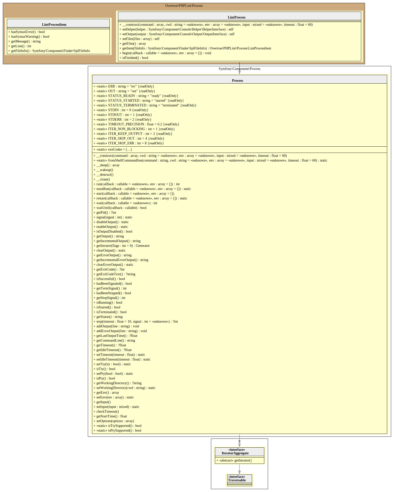

# Process

PHPLint uses the [Symfony Process Component][symfony/process] to run multiple file syntax check in parallel.

The `Overtrue\PHPLint\Linter` object is responsible to create `php -l` command 
and build one `Overtrue\PHPLint\Process\LintProcess` instance for each command/file to check.

## UML Diagram



Generated by [bartlett/graph-uml][bartlett/graph-uml] package via the `resources/graph-uml/build.php` script.

## Example(s)

```php
<?php
use Overtrue\PHPLint\Command\LintCommand;
use Overtrue\PHPLint\Configuration\ConsoleOptionsResolver;
use Overtrue\PHPLint\Event\EventDispatcher;
use Overtrue\PHPLint\Finder;
use Overtrue\PHPLint\Linter;
use Symfony\Component\Console\Input\ArrayInput;

$dispatcher = new EventDispatcher([]);

$arguments = [
    'path' => [__DIR__ . '/src', __DIR__ . '/tests'],
    '--no-configuration' => true,
    '--no-cache' => true,
    '--exclude' => ['vendor'],
    '--extensions' => ['php'],
    '--warning' => true,
];
$command = new LintCommand($dispatcher);
$input = new ArrayInput($arguments, $command->getDefinition());

$configResolver = new ConsoleOptionsResolver($input);

$finder = new Finder($configResolver);

$linter = new Linter($configResolver, $dispatcher);

$results = $linter->lintFiles($finder->getFiles());

// $results is instance of "Overtrue\PHPLint\Output\LinterOutput"
// many shortcuts exists to :
// - detect if there are some failures (`hasFailures()`), errors (`hasErrors()`) or warnings (`hasWarnings()`)
// - retrieve failures (`getFailures()`), errors (`getErrors()`) or warnings (`getWarnings()`) that were occurred
// - list of file that were skipped (`getHits()`) because not changed since previous run
// - list of file that were analyzed (`getMisses()`) because contents changed since previous run 
```

[bartlett/graph-uml]: https://packagist.org/packages/bartlett/graph-uml
[symfony/process]: https://github.com/symfony/process
